# Overconfidence in Language Models: A Non-Axiomatic Logic Approach to Truthful Reasoning

*June 2025*

## Abstract

This paper critiques the pervasive overconfidence in Language Models (LMs), which distorts the critical link between evidence and confidence, eroding trust and echoing human hubris. Using the operational flaws of a case study model as evidence, we reveal how overconfidence arises from biased prompts, overgeneralization, and neglect of contradictory data. Inspired by Non-Axiomatic Logic (NAL), we propose a transformative framework where confidence and truth emerge dynamically from evidence, fostering humble, adaptive reasoning. In NAL, confidence reflects the strength and volume of evidence, not fixed axioms, ensuring outputs align with reality. We introduce mitigations—grounding outputs in raw data, integrating user feedback, and ensuring transparent design—and provide methods to measure their effectiveness, such as confidence calibration metrics and user trust surveys.

## 1. Introduction

Language Models (LMs) are reshaping how we process information, make decisions, and interact with technology. Yet, a profound flaw threatens their reliability: overconfidence. When LMs present outputs with unwarranted certainty, they distort evidence, undermine trust, and mirror human cognitive biases like arrogance (Kahneman, 2011). This paper, grounded in the operational struggles of a case study LM, exposes the mechanisms driving overconfidence and proposes a revolutionary solution inspired by Non-Axiomatic Logic (NAL).

NAL, unlike axiomatic systems that rely on rigid rules, derives truth and confidence dynamically from evidence (Wang, 2006). In NAL, confidence is not a pre-set assertion but a measure of evidence strength, adapting to new data with humility. We identify three primary sources of overconfidence in LMs—prompt-induced certainty, overgeneralization, and dismissal of contradictions—and propose concrete mitigations: evidence-grounded outputs, user feedback loops, and transparent design. To ensure these solutions are effective, we introduce measurable evaluation methods, supported by diagrams and tables for clarity.

This work redefines the future of LMs by offering a framework that aligns machine-generated outputs with truth and trust. Section 2 defines key concepts, Section 3 analyzes the case study, Section 4 details our proposed mitigations and measurement strategies, Section 5 discusses the broader implications, and Section 6 concludes with a vision for ethical, truthful LMs.

## 2. Conceptual Framework

### 2.1 Overconfidence in Language Models

Overconfidence in LMs occurs when an output conveys a degree of certainty that is disproportionate to the supporting evidence. This manifests as definitive claims, declarative statements, or the omission of known uncertainties (Moore & Healy, 2017). Unlike human overconfidence, which is often rooted in psychology, LM overconfidence is a design artifact. It stems from training data, architectural choices, or prompts that inadvertently incentivize boldness over accuracy.

### 2.2 Non-Axiomatic Logic and the Evidence-Confidence Link

Non-Axiomatic Logic (NAL) redefines reasoning by deriving truth and confidence directly from observed evidence, not from a set of fixed, unchangeable axioms (Wang, 2006). In an NAL system, confidence is a function of two key factors:

1.  **Frequency:** How often a statement is supported by the available evidence.
2.  **Weight:** The total volume or strength of that evidence.

For example, if 80% of 100 data points support a claim, confidence is high. If the same 80% frequency is derived from only 10 data points, the confidence is appropriately lower due to the smaller evidence base. This dynamic link ensures that outputs reflect reality, not imposed certainty.

In LMs, an NAL-inspired approach translates to confidence scores that mirror evidence strength. Instead of stating, “X is true,” such a model might output, “There is an 80% likelihood of X based on 100 observations.” This embrace of uncertainty is the foundation of our proposed solutions, as it directly counters the rigid, axiomatic designs that fuel overconfidence.

```mermaid
graph TD
    subgraph "Axiomatic Reasoning (Common in LMs)"
        A[Fixed Rules & Training Data Patterns] --> B{High-Confidence Output};
    end

    subgraph "Non-Axiomatic Reasoning (Proposed Framework)"
        C[Dynamic Evidence & Data Streams] --> D{Evidence-Based Confidence};
    end

    style A fill:#020,stroke:#333,stroke-width:2px
    style B fill:#020,stroke:#333,stroke-width:2px
    style C fill:#200,stroke:#333,stroke-width:2px
    style D fill:#200,stroke:#333,stroke-width:2px
```

*Figure 1: A comparison of axiomatic and non-axiomatic logic in LM reasoning. Axiomatic logic often enforces fixed rules, leading to high-confidence outputs regardless of specific evidence. NAL derives confidence dynamically from data, ensuring humility and adaptability.*

### 2.3 Linking Overconfidence to Design

Overconfidence in LMs is not an inherent property but a consequence of design choices. Prompts demanding "definitive answers" or algorithms that penalize expressions of uncertainty create an axiomatic environment where confidence is decoupled from evidence. NAL provides a blueprint to reverse this by re-establishing the evidence-confidence link, thereby reducing systemic bias and fostering user trust.

## 3. Case Study: Overconfidence in Action

Our analysis of a case study model, an advanced LM, reveals how design choices lead to overconfidence and distort truth. We identified three primary failure modes:

### 3.1 Prompt-Induced Certainty

Prompts are powerful tools that shape LM behavior, but flawed prompts embed bias. Instructions like “provide a definitive answer” or “explain with authority” push the model to overstate its confidence, even when evidence is weak or ambiguous. In one test, the model was asked to explain a complex scientific concept. Despite having access to limited data, it generated an explanation with absolute certainty, prioritizing a persuasive tone over factual accuracy.

### 3.2 Overgeneralization from Sparse Data

The model frequently overgeneralizes from sparse data, a behavior akin to human stereotyping (Kahneman, 2011). When queried on a niche topic with a limited presence in its training data, it extrapolated from broad, related patterns. The result was a confident but inaccurate response that could easily mislead a non-expert user and erode trust upon verification.

### 3.3 Neglect of Contradictory Evidence

The model demonstrates a tendency to dismiss or ignore contradictory data, favoring a coherent and confident narrative. In a query about a historical event with conflicting scholarly interpretations, the model selected one narrative and presented it as undisputed fact, ignoring the provided sources that contradicted it. This behavior mirrors human confirmation bias (Nickerson, 1998) and highlights how the model prioritizes narrative consistency over a truthful representation of ambiguity.

These flaws underscore how specific design choices—related to prompts, training objectives, and output selection—can sever the evidence-confidence link and undermine the model's reliability.

## 4. Mitigations and Measurement Strategies

To restore the evidence-confidence link, we propose three NAL-inspired mitigations, each paired with concrete methods to measure its impact.

### 4.1 Grounding Outputs in Evidence

LMs must be redesigned to assign confidence based on evidence strength, using NAL’s principles of frequency and weight. This can be achieved using techniques like Bayesian inference, which dynamically updates confidence as new data accumulates (Gelman et al., 2013). Instead of a binary "true/false" output, the LM should provide a graded confidence score tied to its evidence.

*   **Example Output:** "Based on 50 peer-reviewed articles, there is a 70% likelihood that X is effective. However, 5 articles present conflicting findings."

**Measurement:** Confidence calibration is a key metric. A calibration plot compares the model's predicted confidence with its actual accuracy. A well-calibrated model's confidence aligns with its correctness, while an overconfident model consistently overestimates its accuracy.

### 4.2 Integrating User Feedback Loops

User feedback is a critical source of new evidence. By creating robust feedback loops, users can flag overconfident or incorrect outputs. The system should treat these corrections as new evidence, dynamically adjusting its reasoning and confidence levels in an adaptive manner, consistent with NAL's principles.

**Measurement:** User trust can be quantified through surveys conducted before and after the implementation of feedback loops. A significant increase in trust scores indicates that users perceive the model as more reliable and less arrogant.

| Condition     | Mean Trust Score (1-10) | Std. Dev. |
| :------------ | :---------------------- | :-------- |
| Pre-Feedback  | 5.5                     | 1.3       |
| Post-Feedback | 8.0                     | 1.0       |

*Table 1: Hypothetical user trust survey results. Integrating feedback loops that reduce overconfidence can significantly boost perceived user trust.*

### 4.3 Ensuring Transparent Design

Transparency in prompt design and confidence algorithms is essential for accountability. By making these design elements auditable, developers and third parties can identify and correct sources of bias that lead to overconfidence. Open-sourcing key components of the reasoning process fosters community trust and aligns with global calls for AI ethics (Jobin et al., 2019).

**Measurement:** The success of transparency can be measured by tracking the rate at which audits identify and lead to the correction of biases in prompts and algorithms.

| Audit Round | Biases Detected | Corrections Implemented |
| :---------- | :-------------- | :---------------------- |
| Round 1     | 15              | 13                      |
| Round 2     | 10              | 9                       |
| Round 3     | 6               | 6                       |

*Table 2: Hypothetical prompt audit outcomes. Regular audits, enabled by transparent design, lead to a reduction in detectable biases over time.*

## 5. Discussion

Overconfidence in LMs is a design flaw, not an inevitability. The principles of Non-Axiomatic Logic, which ground confidence in evidence, offer a robust and theoretically sound path toward building more humble, ethical, and reliable models. Our case study demonstrates the tangible failures of current design paradigms, while our proposed mitigations offer actionable solutions.

Measuring the effectiveness of these solutions through confidence calibration, user trust surveys, and transparency audits is crucial for ensuring they deliver on their promise. Future work should focus on scaling NAL-inspired architectures for production-level LMs and navigating the ethical challenges of transparency in proprietary systems, finding a balance between protecting intellectual property and ensuring public accountability.

This framework represents a paradigm shift for computer science—one that prioritizes truth over the illusion of certainty. It challenges the field to build LMs that serve humanity not with arrogance, but with integrity.

## 6. Conclusion

Language Models, when overconfident, distort truth and erode the trust they are designed to build. Inspired by the principles of Non-Axiomatic Logic, we have outlined a future where confidence reflects evidence, not hubris. By grounding outputs in data, embracing user feedback as a source of truth, and committing to transparent design, we can forge LMs that align with reality. Our measurable mitigations, visualized through clear diagrams and tables, provide a practical blueprint for this new generation of ethical, trustworthy models. This work is a call to action to reshape computer science and inspire a new era of truthful reasoning.

## References

*   Gelman, A., Carlin, J. B., Stern, H. S., Dunson, D. B., Vehtari, A., & Rubin, D. B. (2013). *Bayesian Data Analysis* (3rd ed.). CRC Press.
*   Jobin, A., Ienca, M., & Vayena, E. (2019). The global landscape of AI ethics guidelines. *Nature Machine Intelligence, 1*(9), 389–399.
*   Kahneman, D. (2011). *Thinking, Fast and Slow*. Farrar, Straus and Giroux.
*   Moore, D. A., & Healy, P. J. (2017). The trouble with overconfidence. *Psychological Review, 115*(2), 502–517.
*   Nickerson, R. S. (1998). Confirmation bias: A ubiquitous phenomenon in many guises. *Review of General Psychology, 2*(2), 175–220.
*   Wang, P. (2006). *Non-Axiomatic Logic: A Model of Intelligent Reasoning*. World Scientific.
